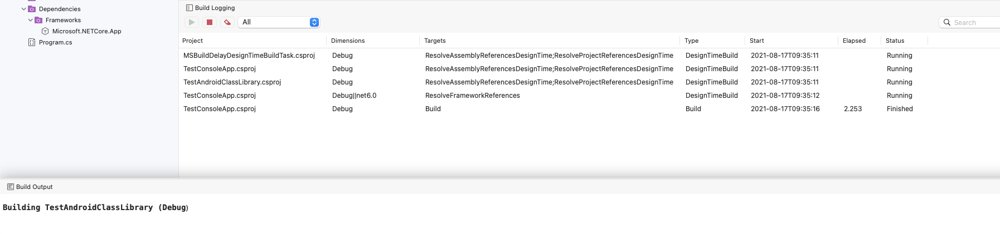

Repro:

- Quit all instances of VS Mac 17.0.

- Disable NuGet package restore in VS Mac 17.0 by opening ~/Library/Preferences/VisualStudio/17.0/MonoDevelopProperties.xml and adding or replacing the section:

    <Property key="PackageManagementSettings">
      <Property key="AutomaticPackageRestoreOnOpeningSolution" value="False" />
      <Property key="CheckUpdatedPackagesOnOpeningSolution" value="False" />
    </Property>

- From the command line build MSBuildDelayDesignTimeBuildTask project.

    msbuild MSBuildDelayDesignTimeBuildTask/MSBuildDelayDesignTimeBuildTask.csproj 

- Start VS Mac

- Open MSBuildDelayDesignTimeBuildTest.sln

- Build the TestConsoleApp project on startup

- See the TestConsoleApp builds straight away and finishes before design time builds complete.

- Build the Android project

- See the Android project does not start the build for 30 seconds whilst design time builds are running for the Android project.

 

Project system tools addin may help see the problem with its Build Logging window:

https://github.com/mrward/monodevelop-project-system-tools/releases/tag/v0.6-vsm17.0

- Install the .mpack via:

    "/Applications/Visual Studio (Preview).app/Contents/MacOS/vstool" setup install "$PWD/MonoDevelop.ProjectSystemTools_0.6.mpack"
